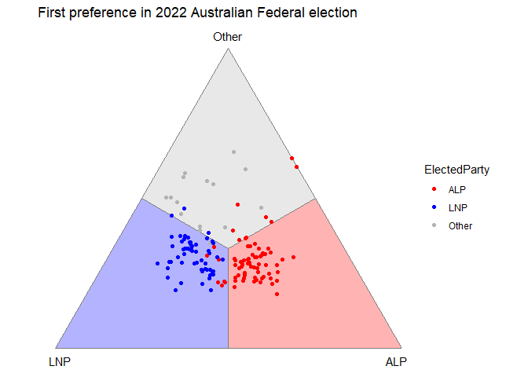
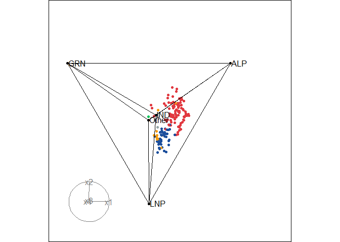

<!-- README.md is generated from README.Rmd. Please edit that file -->

# Overview

Ternary plot is one of the popular ways to visualize preference data,
such as from preferential elections where voters rank candidates
ordinally. Traditionally, ternary plot works with 3-part compositional
variables, representing as 3 vertices of a 2D equilateral triangle.
However, in many cases, preference data consists of more than 3
alternatives, making the 2D ternary plot inadequate to visualize the
data.

`prefviz` provides a solution for creating ternary plots of both two and
higher dimensions. These plots are made compatible with other
interactivity R packages, allowing users to explore their ternary plot
interactively.

# Installation

You can install the development version of `prefviz` via:

``` r
# install.packages("devtools")
remotes::install_github("numbats/prefviz")
```

# Usage

## Prepare your data

For optimal compatibility, we suggest your data have its
alternatives/composition in columns and these columns sum to 1.

``` r
aecdop22_transformed <- prefviz:::aecdop22_transformed
head(aecdop22_transformed) |> select(-CountNumber, -ElectedParty)
#> # A tibble: 6 × 4
#>   DivisionNm   ALP   LNP Other
#>   <chr>      <dbl> <dbl> <dbl>
#> 1 Adelaide   0.400 0.32  0.280
#> 2 Aston      0.325 0.430 0.244
#> 3 Ballarat   0.447 0.271 0.282
#> 4 Banks      0.353 0.452 0.195
#> 5 Barker     0.209 0.556 0.235
#> 6 Barton     0.504 0.262 0.234
```

You can explore the wrapper functions `dop_irv()` and `dop_transform()`
that assist your transformation.

## Prepare components for ternary plot

Every ternary plot is made up of 3 components:

1.  Coordinates of the observations: Your n-part compositional data must
    be transformed into (n-1)-dimensional space via Helmert matrix.
2.  Vertices: The point coordinates that define the vertices of the
    simplex
3.  Edges: How the vertices are connected to create the simplex

These components are provided in a `ternable` object, and can be
accessed directly through the object or via getter functions
`get_tern_*()`. These `get_tern_*()` functions transform the components
of the `ternable` object into suitable input data for `ggplot2` and
`tourr`.

Consider the distribution of first-round preferences in the 2022
Australian Federal Election:

``` r
aecdop22_transformed <- prefviz:::aecdop22_transformed
head(aecdop22_transformed)
#> # A tibble: 6 × 6
#>   DivisionNm CountNumber ElectedParty   ALP   LNP Other
#>   <chr>            <dbl> <chr>        <dbl> <dbl> <dbl>
#> 1 Adelaide             0 ALP          0.400 0.32  0.280
#> 2 Aston                0 LNP          0.325 0.430 0.244
#> 3 Ballarat             0 ALP          0.447 0.271 0.282
#> 4 Banks                0 LNP          0.353 0.452 0.195
#> 5 Barker               0 LNP          0.209 0.556 0.235
#> 6 Barton               0 ALP          0.504 0.262 0.234
```

We can create a `ternable` object using the `ternable()` function:

``` r
tern22 <- ternable(aecdop22_transformed, ALP:Other)
tern22
#> Ternable object
#> ----------------
#> Items: ALP, LNP, Other 
#> Vertices: 3 
#> Edges: 6
```

## Draw a 2D ternary plot

``` r
# Get the input data
input_df <- get_tern_data(tern22, plot_type = "2D")
head(input_df)
#>   DivisionNm CountNumber ElectedParty    ALP    LNP  Other          x1
#> 1   Adelaide           0          ALP 0.3998 0.3200 0.2802  0.05642712
#> 2      Aston           0          LNP 0.3255 0.4305 0.2440 -0.07424621
#> 3   Ballarat           0          ALP 0.4474 0.2709 0.2817  0.12480435
#> 4      Banks           0          LNP 0.3526 0.4522 0.1952 -0.07042784
#> 5     Barker           0          LNP 0.2085 0.5563 0.2352 -0.24593174
#> 6     Barton           0          ALP 0.5043 0.2619 0.2338  0.17140268
#>            x2
#> 1 -0.06507478
#> 2 -0.10941054
#> 3 -0.06323766
#> 4 -0.16917809
#> 5 -0.12018830
#> 6 -0.12190294

# Visualize
ggplot(input_df, aes(x = x1, y = x2)) +
  geom_ternary_cart() +
  geom_ternary_region(
    vertex_labels = tern22$vertex_labels,
    aes(fill = after_stat(vertex_labels)), 
    alpha = 0.3, color = "grey50",
    show.legend = FALSE
  ) +
  geom_point(aes(color = ElectedParty)) +
  add_vertex_labels(tern22$simplex_vertices) +
  scale_fill_manual(
    values = c("ALP" = "red", "LNP" = "blue", "Other" = "grey70"),
    aesthetics = c("fill", "colour")
  ) +
  labs(title = "First preference in 2022 Australian Federal election")
```



## Draw a high-dimensional ternary plot

``` r
# Load the data
aecdop25_transformed <- prefviz:::aecdop25_transformed
head(aecdop25_transformed)
#> # A tibble: 6 × 8
#>   DivisionNm CountNumber ElectedParty   ALP    GRN   LNP Other    IND
#>   <chr>            <dbl> <chr>        <dbl>  <dbl> <dbl> <dbl>  <dbl>
#> 1 Adelaide             0 ALP          0.465 0.190  0.242 0.104 0     
#> 2 Aston                0 ALP          0.373 0      0.377 0.209 0.0414
#> 3 Ballarat             0 ALP          0.424 0      0.286 0.262 0.0281
#> 4 Banks                0 ALP          0.364 0.119  0.391 0.106 0.0202
#> 5 Barker               0 LNP          0.225 0.0816 0.5   0.135 0.0586
#> 6 Barton               0 ALP          0.471 0.159  0.242 0.128 0

# Create ternable object
tern25 <- ternable(aecdop25_transformed, ALP:IND)

# Add colors to the points
party_colors <- c(
  "ALP" = "#E13940",    # Red
  "LNP" = "#1C4F9C",    # Blue
  "GRN" = "#10C25B",    # Green
  "IND" = "#F39C12",    # Orange
  "Other" = "#95A5A6"   # Gray
)

# Map to your data (assuming your column is called elected_party)
color_vector <- c(rep("black", 5),
  party_colors[aecdop25_transformed$ElectedParty])

# Animate the tour
animate_xy(
  get_tern_data(tern25, plot_type = "HD"), 
  edges = get_tern_edges(tern25),
  obs_labels  = get_tern_labels(tern25),
  col = color_vector,
  axes = "bottomleft"
)
```



# References

Cook D., Laa, U. (2024) Interactively exploring high-dimensional data
and models in R, <https://dicook.github.io/mulgar_book/>, accessed on
2025/12/20.
