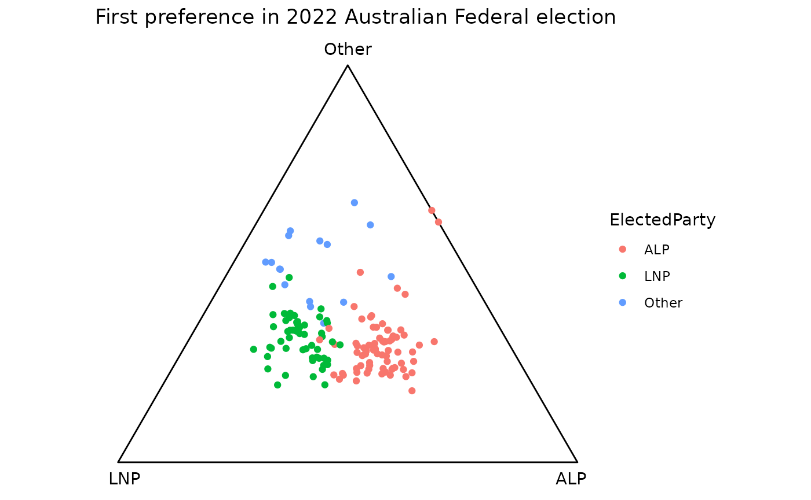
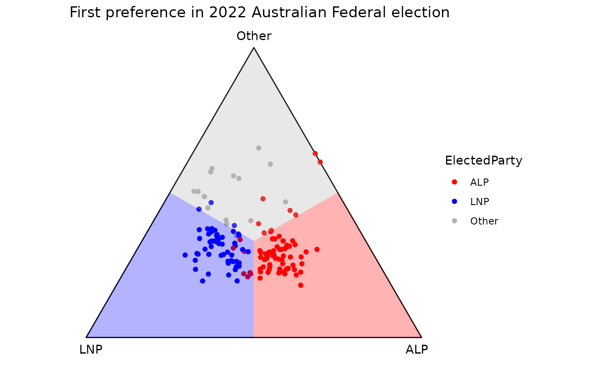
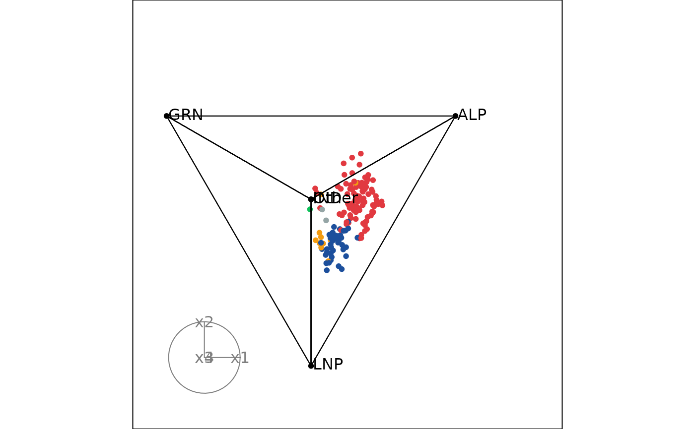
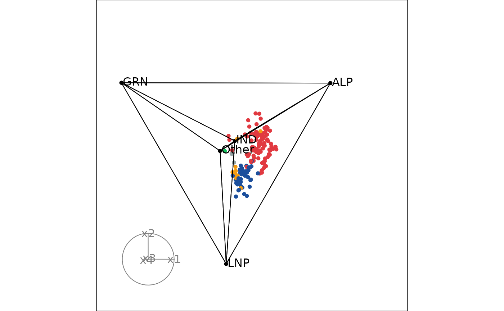

# Using \`ternable\` object to draw ternary plots

This vignette shows you how to build a ternary plot on 2 and higher
dimensions, using the `ternable` object.

Both 2D and high-dimensional (HD) ternary plots require the following 3
components:

- Coordinates of the observations: Your n-part compositional data must
  be transformed into (n-1)-dimensional space via Helmert matrix.
- Vertices: The point coordinates that define the vertices of the
  simplex
- Edges: How the vertices are connected to create the simplex

You can access all these components conveniently via a `ternable`
object.

## `ternable` object

`ternable` is a simple S3 object that contains all the data and metadata
useful for ternary plots, including the following components:

- `data`: Stores input data after being validated and normalized
- `data_coord`: Stores the coordinates for all observations.
- `data_edges`: Stores the connections between the observations. Useful
  when you want to create paths between observations.
- `simplex_vertices`: Stores the simplex vertices’ coordinates.
- `simplex_edges`: Stores the connections between the simplex vertices.
- `vertex_labels`: Stores the vertex labels/item names in the order
  provided in the argument `items`.

To create a `ternable` object, simply call the function
[`as_ternable()`](https://numbats.github.io/prefviz/reference/as_ternable.md).
[`as_ternable()`](https://numbats.github.io/prefviz/reference/as_ternable.md)
takes 2 arguments:

- `data`: The input data, which must be in a `ternable`-friendly format.
  For more details on how to transform your raw data into a
  `ternable`-friendly format, please refer to
  [`vignette("transform_raw_data")`](https://numbats.github.io/prefviz/articles/transform_raw_data.md)
- `items`: The item names in the order you want them to appear in the
  ternary plot. The default takes all the columns in `data`.

``` r
aecdop22_transformed <- prefviz::aecdop22_transformed |> 
  filter(CountNumber == 0)
head(aecdop22_transformed)
#> # A tibble: 6 × 6
#>   DivisionNm CountNumber ElectedParty   ALP   LNP Other
#>   <chr>            <dbl> <chr>        <dbl> <dbl> <dbl>
#> 1 Adelaide             0 ALP          0.400 0.32  0.280
#> 2 Aston                0 LNP          0.325 0.430 0.244
#> 3 Ballarat             0 ALP          0.447 0.271 0.282
#> 4 Banks                0 LNP          0.353 0.452 0.195
#> 5 Barker               0 LNP          0.209 0.556 0.235
#> 6 Barton               0 ALP          0.504 0.262 0.234

tern22 <- as_ternable(data = aecdop22_transformed, items = ALP:Other)
tern22
#> Ternable object
#> ----------------
#> Items: ALP, LNP, Other 
#> Vertices: 3 
#> Edges: 6
```

### `ternable` helpers - `get_tern_*()`

While `ternable` provides you with the essenstial components for
building a ternary plot, different plot types (2D or HD) might require
slightly different way of representing these commponents. `get_tern_*()`
functions help you do just that.

Under the hood, `get_tern_*()` perform simple data transformations,
i.e., [`rbind()`](https://rdrr.io/r/base/cbind.html) and
[`cbind()`](https://rdrr.io/r/base/cbind.html), to help you create the
input that are compatible with popular plotting packages, i.e.,
`ggplot2` for 2D ternary plot and `tourr` for HD ternary plots.

There are 3 `get_tern_*()` functions:

- [`get_tern_data2d()`](https://numbats.github.io/prefviz/reference/ternary_getters.md):
  Provides input data for `ggplot2` (2D ternary plots).
- [`get_tern_datahd()`](https://numbats.github.io/prefviz/reference/ternary_getters.md):
  Provides input data for `tourr` (high-dimensional ternary plots). The
  returned data frame includes a `labels` column containing vertex names
  for simplex rows and `""` for observation rows, which can be passed
  directly to `tourr`’s `obs_labels` argument.
- [`get_tern_edges()`](https://numbats.github.io/prefviz/reference/ternary_getters.md):
  Provides edges of the simplex, which is required by `tourr`.

Note:
[`get_tern_labels()`](https://numbats.github.io/prefviz/reference/ternary_getters.md)
is deprecated. Use `get_tern_datahd(tern)[["labels"]]` instead.

## Drawing a 2D ternary plot

Take the example of the 2022 Australian Federal Election, we would like
to take a look at the first preference distribution between the 2 major
parties: Labor and the Coalition, and other parties.

The dataset `aecdop22_transformed` is already in a `ternable`-friendly
format, so we can directly pass it to
[`as_ternable()`](https://numbats.github.io/prefviz/reference/as_ternable.md)
to create a `ternable` object.

``` r
tern22 <- as_ternable(aecdop22_transformed, ALP:Other)
```

Now we can use the
[`get_tern_data2d()`](https://numbats.github.io/prefviz/reference/ternary_getters.md)
function to get the input data for `ggplot2`.

``` r
input_df <- get_tern_data2d(tern22)
head(input_df)
#> # A tibble: 6 × 8
#>   DivisionNm CountNumber ElectedParty   ALP   LNP Other      x1      x2
#>   <chr>            <dbl> <chr>        <dbl> <dbl> <dbl>   <dbl>   <dbl>
#> 1 Adelaide             0 ALP          0.400 0.32  0.280  0.0564 -0.0651
#> 2 Aston                0 LNP          0.325 0.430 0.244 -0.0742 -0.109 
#> 3 Ballarat             0 ALP          0.447 0.271 0.282  0.125  -0.0632
#> 4 Banks                0 LNP          0.353 0.452 0.195 -0.0704 -0.169 
#> 5 Barker               0 LNP          0.209 0.556 0.235 -0.246  -0.120 
#> 6 Barton               0 ALP          0.504 0.262 0.234  0.171  -0.122
```

The output is a data frame where the original columns are combined with
the coordinates (`x1`, `x2`). These coordinate columns are the
observation locations on the plot. We can now use `ggplot2` to draw the
ternary plot.

``` r
p <- ggplot(input_df, aes(x = x1, y = x2)) +
  # Draw the ternary space as an equilateral triangle
  add_ternary_base() + 
  # Plot the observations as points
  geom_point(aes(color = ElectedParty)) + 
  # Add vertex labels, taken from the ternable object
  add_vertex_labels(tern22$simplex_vertices) + 
  labs(title = "First preference in 2022 Australian Federal election")

p
```



In an election, we would be interested in defining the regions where one
party takes the majority over others. We can do that using
[`geom_ternary_region()`](https://numbats.github.io/prefviz/reference/geom_ternary_region.md).

This geom takes the barycentric coordinates of a reference point as
input, and divides the ternary triangle into 3 regions based on the
reference points. These regions are defined by the perpendicular
projections of the reference point to the three edges of the triangle.
The default reference point is the centroid, which divides the triangle
into 3 equal regions.

``` r
p + 
  geom_ternary_region(
    x1 = 1/3, x2 = 1/3, x3 = 1/3, # Default reference points. Must sum to 1
    vertex_labels = tern22$vertex_labels, # Labels for the regions
    aes(fill = after_stat(vertex_labels)), 
    alpha = 0.3, color = NA, show.legend = FALSE
  ) +
  scale_fill_manual(
    values = c("ALP" = "red", "LNP" = "blue", "Other" = "grey70"),
    aesthetics = c("fill", "colour")
  )
```



`vertex_labels` argument is used to specify the vertex of which the
region belongs to. This is helpful when you want to “sync” the aesthetic
mapping of
[`geom_ternary_region()`](https://numbats.github.io/prefviz/reference/geom_ternary_region.md)
with the base layer because you only need to specify the customization
once.

Please note that the order in which the labels are provided must match
the order of the vertices in the ternary plot. The vertices are listed
clockwise, from the right (ALP) to the left (LNP), then ending at the
top of the triangle (Other). The best way is to get these labels from
`ternable$vertex_labels` as `ternable` preserves the vertex orders.

## Drawing a high-dimensional ternary plot

Take the example of the 2025 Australian Federal Election, we would like
to take a look at the first preference distribution between the 4 major
groups: Labor, Coalition, Greens, Independents and the other party. This
can be conveniently done using the `tourr` package, `ternable` object
and the `get_tern_*()` functions.

A ternary tour requires the following components:

- Coordinates of the observations and vertices
- Edges of the simplex
- Vertex labels (good to have to identify the vertices during the tour)

``` r
# Load the data
aecdop25_transformed <- prefviz::aecdop25_transformed |> 
  filter(CountNumber == 0)
head(aecdop25_transformed)
#> # A tibble: 6 × 8
#>   DivisionNm CountNumber ElectedParty   ALP    GRN   LNP Other    IND
#>   <chr>            <dbl> <chr>        <dbl>  <dbl> <dbl> <dbl>  <dbl>
#> 1 Adelaide             0 ALP          0.465 0.190  0.242 0.104 0     
#> 2 Aston                0 ALP          0.373 0      0.377 0.209 0.0414
#> 3 Ballarat             0 ALP          0.424 0      0.286 0.262 0.0281
#> 4 Banks                0 ALP          0.364 0.119  0.391 0.106 0.0202
#> 5 Barker               0 LNP          0.225 0.0816 0.5   0.135 0.0586
#> 6 Barton               0 ALP          0.471 0.159  0.242 0.128 0

tern25 <- as_ternable(aecdop25_transformed, ALP:IND)

# Animate the tour
tourr_data <- get_tern_datahd(tern25)
animate_xy(
  dplyr::select(tourr_data, starts_with("x")), # Coordinates of the observations and vertices
  edges = get_tern_edges(tern25), # Edges of the simplex
  obs_labels = tourr_data[["labels"]], # Labels for the vertices
  axes = "bottomleft"
)
```


We can add colors to the points.

``` r
# Define color mapping
party_colors <- c(
  "ALP" = "#E13940",    # Red
  "LNP" = "#1C4F9C",    # Blue
  "GRN" = "#10C25B",    # Green
  "IND" = "#F39C12",    # Orange
  "Other" = "#95A5A6"   # Gray
)

# Map to your data (assuming your column is called elected_party)
color_vector <- c(rep("black", 5),
  party_colors[aecdop25_transformed$ElectedParty])

# Animate the tour (tourr_data already defined above)
animate_xy(
  dplyr::select(tourr_data, starts_with("x")),
  edges = get_tern_edges(tern25),
  obs_labels = tourr_data[["labels"]],
  col = color_vector,
  axes = "bottomleft"
)
```


