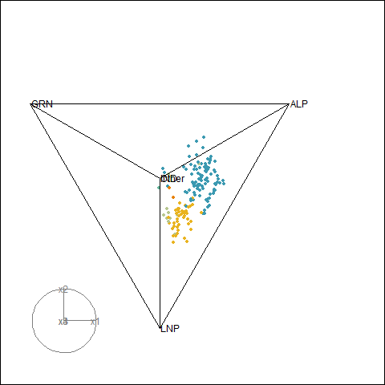

```{css}
#| include: false

.reveal h1, .reveal h2, .reveal h3 {
  text-transform: none;
}

.reveal h1 {
  font-size: 2em;
}

.reveal h2 {
  font-size: 1.6em;
  margin-top: 0.5em;
}

.reveal pre {
  width: 100%;
  font-size: 0.55em;
}

.reveal code {
  padding: 2px 6px;
  background: rgba(0,0,0,0.1);
}

.columns {
  display: flex;
  gap: 2em;
}

.column {
  flex: 1;
}

.small-text {
  font-size: 0.8em;
}
```

```{r setup}
#| include: false
source(here::here("inst/dev/package_demo.R"))

library(ggplot2)
library(prefio)
library(prefviz)
library(dplyr)
library(plotly)
library(kableExtra)
```

## Our inspiration and challenges

:::: {.columns}

::: {.column width="50%"}
**ABC News shows interesting plot on 2025 House of Rep's distribution of first preference**


:::

::: {.column width="50%"}

**But some challenges with this plot:**

1. How can we quickly tell the coordinates, corresponding electorate, and other context? -> **Need interactivity**
2. How can we include more parties in the visualization? -> **Need to visualize points in simplex of higher-dimensions**

=> `prefviz` creates a uniform way of visualizing ternary plot of any dimensions
:::

::::

## We make 2D ternary plot interactive...

:::: {.columns}

::: {.column width="50%"}

**First Preference Distribution**

Hover to see electorate names and exact vote percentages.
```{r}
#| echo: false

p2d_interactive
```

:::

::: {.column width="50%"}

**Full Preference Flow**

Track how votes move between parties as candidates are eliminated.
```{r}
#| echo: false

p2d_line_interactive
```

:::

::::

## And we make interactive high-dimensional ternary plot

For elections with 4+ significant parties, we integrate with **`tourr`** and **`detourr`** for dynamic rotations through preference space.

```{r}
#| echo: false
de
```

# Overview of `prefviz` functions

| **Step** | **Data Transformation** | **Extract Ternary Components** | **Visualization** |
|:--------:|:----------------------:|:------------------------------:|:-----------------:|
| **What it does** | Convert raw ballot data to aggregated compositional percentages | Build geometric infrastructure (vertices, edges, coordinates) | Interactive 2D or high-dimensional plots |
| **Key functions** | `dop_irv()` – for raw ballot data<br/>`dop_transform()` – reshape aggregated data | `ternable()` – create `ternable`object<br/>Getter functions for transforming components to appropriate shapes | `ggplot2` + `plotly` (2D)<br/>`tourr` + `detourr` (high-D) |
| **Input** | Raw ballots or aggregated preferences | Standardized compositional data | Ternary components from `ternable` object |
| **Output** | Clean, standardized format | Geometric objects ready to plot | Interactive, explorable visualization |

# Recreate the example

## Step 1: Transformation from raw to compositional data

:::: {.columns}

::: {.column width="50%"}
AEC's 2025 House of Representatives distribution of preferences is in aggregated percentage, with each row representing the preference of a party in an electorate.

```{r}
#| echo: true
#| code-fold: false
pref25_2d <- aecdop_2025 |> 
  filter(CalculationType == "Preference Percent") |>
  mutate(Party = case_when(
    !(PartyAb %in% c("LP", "ALP", "NP", "LNP", "LNQ")) ~ "Other", 
    PartyAb %in% c("LP", "NP", "LNP", "LNQ") ~ "LNP",
    TRUE ~ PartyAb
  ))
head(pref25_2d)
```

:::

::: {.column width="50%"}
Transformed data with 3 columns representing the composition of each party in each electorate, summing to 1.

```{r}
#| echo: true
#| code-fold: false
pref25_2d <- dop_transform(
  data = pref25_2d,
  key_cols = c(DivisionNm, CountNumber),
  value_col = CalculationValue,
  item_col = Party,
  winner_col = Elected,
  winner_identifier = "Y"
)
pref25_2d
```

:::

::::

## Step 2: Get components of ternary plots

`ternable()` creates a `ternable` object, which is a S3 object that contains the data and metadata necessary for ternary plots, including the vertices, edges, labels of the simplex, and coordinates of all data points. 

:::: {.columns}

::: {.column width="50%"}

```{r}
#| echo: true
#| code-fold: false
tern_2d <- ternable(pref25_2d, items = ALP:Other)
tern_2d
```

:::

::: {.column width="50%"}

```{r}
#| echo: true
#| code-fold: false
str(tern_2d)
```

:::

::::

## Step 3: Visualization (2D)

`prefviz` includes some `ggplot2` extensions to make creating ternary plots easier. Output is compatible with `plotly` and `ggiraph`.

:::: {.columns}

::: {.column width="50%"}
```{r}
#| echo: true
#| output: false
#| code-fold: false
input_data <- get_tern_data(tern_2d, plot_type = "2D") |> 
  mutate(text = paste0(DivisionNm, "\n",
                "ALP: ", round(ALP, 1), "%\n",
                "LNP: ", round(LNP, 1), "%\n",
                "Other: ", round(Other, 1), "%"))

p2d <- ggplot(input_data |> filter(CountNumber == 0), aes(x = x1, y = x2)) +
  geom_ternary_cart() + 
  geom_ternary_region(
    aes(fill = after_stat(vertex_labels)),
    x1 = 1/3, x2 = 1/3, x3 = 1/3,
    vertex_labels = tern_2d$vertex_labels,
    alpha = 0.3, color = NA, show.legend = FALSE
  ) +
  add_vertex_labels(tern_2d$simplex_vertices) + 
  geom_point(aes(color = Winner, text = text)) + 
  scale_fill_manual(
    values = c("ALP" = "red", "LNP" = "blue", "Other" = "grey70")
  ) +
  scale_color_manual(
    values = c("ALP" = "red", "LNP" = "blue", "Other" = "grey70"),
    name = "Elected Party"
  ) +
  labs(title = "First preference in 2022 Australian Federal election")

plotly_ternary <- ggplotly(p2d, tooltip = "text", width = 600, height = 400)
```

:::

::: {.column width="50%"}

```{r}
#| echo: false
plotly_ternary
```

:::
::::

## Step 3: Visualization (High Dimensions)

`prefviz` depends on `tourr` for high-dimensional visualization, and `detourr` for interactive tours.

:::: {.columns}

::: {.column width="60%"}

```{r}
#| eval: false
#| echo: true
#| code-fold: false
color_vector <- c(rep("black", 5),
  party_colors[pref25_hd$Winner])

# Animate the tour
animate_xy(
  get_tern_data(tern_hd, plot_type = "HD"), 
  edges = get_tern_edges(tern_hd),
  obs_labels  = get_tern_labels(tern_hd),
  col = color_vector,
  axes = "bottomleft"
)
```

:::

::: {.column width="40%"}



:::
::::

# Current status

:::: {.columns}

::: {.column width="50%"}

**Priorities**

- CRAN submission by end of February
- First draft of the paper for R journal

:::

::: {.column width="50%"}

**Potential avenues**

- Extend the application of ternary plots. The primary focus is on distribution of preferences under instant-runoff voting,but the simplex space has potential to show the margin of victory, or compare results of different electoral systems.
- Make the package more user-friendly. Customization options are limited, especially for `detourr` integration.
- Run elections under different voting systems. The transformation functions are currently limmited to IRV. 

:::

::::

