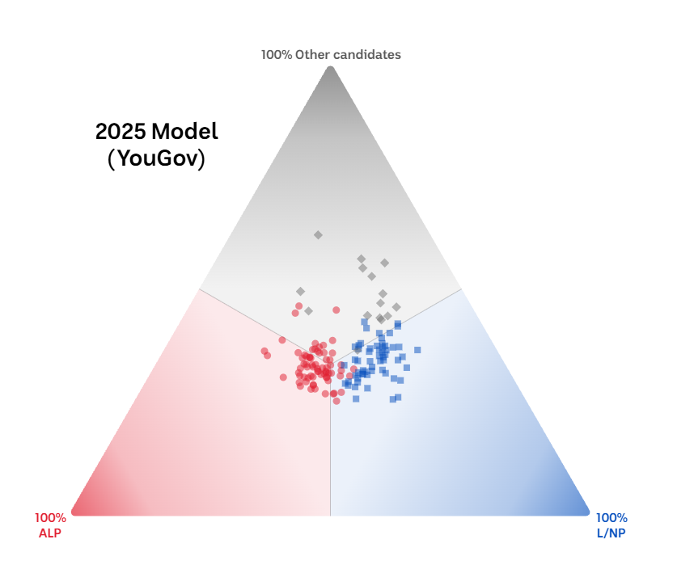

```{css}
#| include: false

.reveal h1, .reveal h2, .reveal h3 {
  text-transform: none;
}

.reveal h1 {
  font-size: 2em;
}

.reveal h2 {
  font-size: 1.6em;
  margin-top: 0.5em;
}

.reveal pre {
  width: 100%;
  font-size: 0.55em;
}

.reveal code {
  padding: 2px 6px;
  background: rgba(0,0,0,0.1);
}

.columns {
  display: flex;
  gap: 2em;
}

.column {
  flex: 1;
}

.small-text {
  font-size: 0.8em;
}
```

```{r setup}
#| include: false
library(ggplot2)
library(dplyr)
library(plotly)
library(kableExtra)
library(tibble)
library(prefio)
library(prefviz)

# Load or simulate your data for demonstration
# This is a placeholder - replace with actual prefviz functions
```

# The Problem: Elections Are Complex

## What You See on the News

:::: {.columns}

::: {.column width="50%"}
**ABC News 2025 House of Representatives**



A clean, simple visualization of electoral preferences.
:::

::: {.column width="50%"}

**But the reality is more complicated:**

- Elections have **4, 5, or more significant parties**
- Voters show **complex preference patterns** across all parties
- **Regional variation** in coalition strength
- **Temporal dynamics** through preference counting stages
- **Context matters**: Which electorate? What's the margin?

**The Gap:** How do we explore this complexity interactively?

:::

::::

## Our Research Questions

1. **Can we make ternary plots interactive?**
   - Hover to see exact electorate names and vote percentages
   - Zoom into regions of interest
   - Identify subtle patterns in preference distributions

2. **Can we visualize beyond 3 parties?**
   - Include Greens, Independents, and regional parties
   - Understand coalition dynamics across all political forces
   - See voter preference shifts in high-dimensional space

3. **Can we create a unified pipeline?**
   - From raw ballot data → clean visualization
   - Working across different data formats
   - Reproducible and accessible for other researchers

**Our answer: prefviz**

---

# What prefviz Does

## 2D Interactive Exploration

:::: {.columns}

::: {.column width="50%"}

**First Preference Distribution**
```{r}
#| echo: false
# Placeholder for interactive plot
# p2d_interactive
"[Interactive ternary plot showing all electorates]"
```

Hover to see electorate names and exact vote percentages.

:::

::: {.column width="50%"}

**Full Preference Flow**
```{r}
#| echo: false
# Placeholder for second visualization
# p2d_line_interactive
"[Preference flow visualization across counting stages]"
```

Track how votes move between parties as candidates are eliminated.

:::

::::

## High-Dimensional Exploration

For elections with 4+ significant parties, we integrate with **tourr** for dynamic rotations through preference space.

```{r}
#| echo: false
# Placeholder for tourr visualization
"[Dynamic tour through 4D+ simplex space]"
```

**See the real electoral story:** How all parties compete simultaneously, revealing:
- Coalition preference patterns
- Regional clustering in preference distributions
- Voter behavior complexity across all political forces

---

# How prefviz Works: Three-Step Pipeline

## The Workflow

| **Step** | **Data Transformation** | **Extract Ternary Components** | **Visualization** |
|:--------:|:----------------------:|:------------------------------:|:-----------------:|
| **What it does** | Convert raw ballot data to aggregated compositional percentages | Build geometric infrastructure (vertices, edges, coordinates) | Interactive 2D or high-dimensional plots |
| **Key functions** | `dop_irv()` – from ballot data<br/>`dop_transform()` – reshape aggregated data | `ternable()` – create object<br/>Getter functions for components | ggplot2 + plotly (2D)<br/>tourr + detourr (high-D) |
| **Input** | Raw ballots or aggregated preferences | Standardized compositional data | Ternary components from ternable object |
| **Output** | Clean, standardized format | Geometric objects ready to plot | Interactive, explorable visualization |

---

# Step 1: Data Transformation

## Why Standardization Matters

Electoral preference data comes in many formats:

- **Raw ballot records** from electronic voting systems
- **PrefLib format** (academic standard for ranking data)
- **AEC tabulation sheets** (Australian Electoral Commission)
- **Aggregated percentages** from different sources

**prefviz solves this with two functions:**

### For Raw Ballot Data: `dop_irv()`

```{r}
# library(prefviz)
# library(dplyr)

# # Transform instant-runoff voting ballots to preferences
# ballot_data <- read_preflib("election_ballots.soc")
# agg_data <- dop_irv(ballot_data)

# head(agg_data)
# # Shows: ALP%, LNP%, Greens%, Other%, count for each group
```

### For Pre-Aggregated Data: `dop_transform()`

```{r}
# Reshape data from different formats to standard composition
# electoral_data <- dop_transform(
#   data = your_prefs,
#   key_cols = c("electorate", "counting_stage"),  # Grouping variables
#   value_col = "vote_percent",                     # The percentages
#   item_col = "party",                             # Categories to spread
#   winner_col = "elected_party",
#   winner_identifier = "YES"
# )
```

**Output:** Clean data with columns for each party percentage + metadata.

---

# Step 2: Extract Ternary Components

## The ternable Object

Once you have standardized compositional data, create a **ternable object** that stores everything needed to draw ternary plots:

```{r}
# Create the ternary infrastructure
tern_2d <- ternable(electoral_data, items = ALP:Other)

# Inspect what we've got
tern_2d
# Shows: 3 vertices, vertex labels, transformed coordinates
```

## What's Inside ternable?

The object contains:

```{r}
tern_2d$simplex_vertices    # The three corners of the triangle
tern_2d$vertex_labels       # Party names (ALP, LNP, Other, etc.)
tern_2d$data                # Your data with ternary coordinates (x1, x2, x3)
tern_2d$composition_cols    # Which columns represent the composition
```

**Behind the scenes:** The package handles the geometric mathematics:
- Converts percentages (ALP: 40%, LNP: 35%, Other: 25%) 
- Into 2D Cartesian coordinates (x1, x2) representing position in simplex
- Or higher-dimensional coordinates for 4+ parties

---

# Step 3: Visualization in 2D

## Building Interactive Plots

```{r}
#| code-fold: false
library(ggplot2)
library(plotly)

# Get data in plottable form
plot_data <- get_tern_data(tern_2d, plot_type = "2D") %>%
  mutate(hover_text = paste0(
    electorate, "\n",
    "ALP: ", round(ALP, 1), "%\n",
    "LNP: ", round(LNP, 1), "%\n",
    "Other: ", round(Other, 1), "%"
  ))

# Create ternary plot
p <- ggplot(plot_data, aes(x = x1, y = x2)) +
  geom_ternary_cart() +                    # Triangle framework
  geom_ternary_region(                     # Shaded party dominance regions
    aes(fill = after_stat(vertex_labels)),
    x1 = 1/3, x2 = 1/3, x3 = 1/3,
    vertex_labels = tern_2d$vertex_labels,
    alpha = 0.3, color = NA, show.legend = FALSE
  ) +
  add_vertex_labels(tern_2d$simplex_vertices) +  # Party labels
  geom_point(aes(color = Winner), size = 3) +     # Electorates
  scale_color_manual(
    values = c("ALP" = "red", "LNP" = "blue", "Other" = "green"),
    name = "Winning Party"
  ) +
  theme_minimal() +
  labs(title = "2022 Australian Election: First Preference Distribution")

# Make interactive!
ggplotly(p, tooltip = "hover_text")
```

## Understanding the Plot

**The Triangle (Ternary Plot):**
- Each **vertex** = 100% to one party
- **Bottom left** = Labor strongholds
- **Bottom right** = Coalition strongholds
- **Top** = Other parties competitive
- **Center** = Three-way contests

**Each point:** Represents one electorate or counting stage

**Hover to see:** Exact electorate name and vote percentages

---

# Step 3: Visualization in High Dimensions

## Beyond 3 Parties

Include all major political forces:

```{r}
# Include Greens explicitly
electoral_data_4d <- aec_prefs %>%
  mutate(Party = case_when(
    PartyAb == "ALP" ~ "Labor",
    PartyAb %in% c("LP", "NP", "LNP", "LNQ") ~ "Coalition",
    PartyAb == "GRN" ~ "Greens",
    TRUE ~ "Other"
  )) %>%
  dop_transform(key_cols = c(DivisionNm, CountNumber), ...)

# Create 4D simplex object
tern_4d <- ternable(electoral_data_4d, items = Labor:Other)

# Explore with tourr (dynamic rotations)
plot_data_4d <- get_tern_data(tern_4d, plot_type = "HD")
visualize_tour(plot_data_4d)
```

## Why High-Dimensional Tours?

With **tourr**, you dynamically rotate through different 2D projections of the 4D simplex:

- See **cluster structure** in preference distributions
- Reveal **hidden coalitions** across all parties
- Identify **outlier electorates** with unusual patterns
- Understand **regional variations** in full detail

**The payoff:** Modern electoral complexity revealed.

---

# Real Example: 2022 Australian Election

## Your Research Workflow

**Research Question:** How did voter preferences distribute across Labor, Coalition, and Greens? Where did preferences overlap? Where did they diverge?

## Step 1: Load and Clean

```{r}
#| code-fold: false
# Load AEC data
aec_prefs <- read_csv("aec_2022_preferences.csv")

# Transform to standard format
electoral_data <- aec_prefs %>%
  filter(CalculationType == "Preference Percent") %>%
  mutate(Party = case_when(
    !(PartyAb %in% c("ALP", "LNP")) ~ "Other",
    TRUE ~ PartyAb
  )) %>%
  dop_transform(
    key_cols = c(DivisionNm, CountNumber),
    value_col = CalculationValue,
    item_col = Party,
    winner_col = Elected,
    winner_identifier = "Y"
  )
```

**Output:** Clean data with columns: ALP%, LNP%, Other%, Winner, DivisionNm, CountNumber

## Step 2: Build Infrastructure

```{r}
#| code-fold: false
# Create ternary object
tern_2d <- ternable(electoral_data, items = ALP:Other)

# Quick inspection
tern_2d
```

**What you get:** 
- 3 vertices (triangle corners)
- Vertex labels (ALP, LNP, Other)
- Data transformed to ternary coordinates

## Step 3: Visualize and Explore

```{r}
#| code-fold: false
# Get plottable data
plot_data <- get_tern_data(tern_2d, plot_type = "2D") %>%
  mutate(text = paste0(
    DivisionNm, "\n",
    "ALP: ", round(ALP, 1), "%\n",
    "LNP: ", round(LNP, 1), "%\n",
    "Other: ", round(Other, 1), "%"
  ))

# Create plot (simplified version)
p <- ggplot(plot_data |> filter(CountNumber == 0), 
            aes(x = x1, y = x2, color = Winner)) +
  geom_point(size = 3) +
  scale_color_manual(
    values = c("ALP" = "red", "LNP" = "blue", "Other" = "green")
  ) +
  theme_minimal() +
  coord_fixed() +
  labs(title = "First Preference: 2022 Australian Election")

# Interactive version
ggplotly(p, tooltip = "text")
```

---

# What This Reveals

## Electoral Patterns Visible in Simplex Space

:::: {.columns}

::: {.column width="50%"}

**Regional Clustering:**
- Metropolitan electorates cluster together
- Rural regions form separate clusters
- See coalition strength patterns immediately

**Coalition Dynamics:**
- Labor-heavy electorates (toward bottom-left)
- Coalition-heavy electorates (toward bottom-right)
- Swing zones in the middle

:::

::: {.column width="50%"}

**Preference Overlaps:**
- Where do Labor and Greens voters overlap in preference?
- Which electorates show three-way contests?
- Where does one coalition dominate absolutely?

**Temporal Dynamics:**
- Track first preference → final count movement
- See how preferences shift as candidates eliminated
- Understand voter behavior across counting stages

:::

::::

---

# Why prefviz Matters for Research

## Enables New Research Directions

1. **Regional Comparison**
   - Cluster electorates by preference patterns
   - Compare urban vs rural voting behavior
   - Identify swing zones and coalition strongholds

2. **Temporal Analysis**
   - Track preference shifts across counting stages
   - Reveal voter volatility and strategic voting
   - Understand coalition support dynamics

3. **Strategic Insights**
   - Identify "swing zones" in preference space
   - Understand where small shifts change outcomes
   - Guide campaign strategy through data

4. **Data Accessibility**
   - Make complex electoral data understandable to public
   - Journalists can explore and tell data-driven stories
   - Policymakers see coalition patterns clearly

5. **Research Reproducibility**
   - Standardized workflow colleagues can replicate
   - Transparent pipeline from data to insight
   - Build on each other's work

---

# Package Design Philosophy

## Built for Electoral Researchers (Not Just Developers)

**Tidy Data Integration**
```r
# Works with dplyr naturally
data %>%
  filter(electorate == "Melbourne") %>%
  dop_transform(...) %>%
  ternable(...)
```

**Grammar of Graphics**
```{r}
# Full ggplot2 power for customization
p <- ggplot(...) +
  geom_ternary_cart() +
  geom_ternary_region(...) +
  # All standard ggplot2 customization available
  theme_minimal() +
  scale_color_manual(...)
```

**Interactivity First**
- plotly integration for 2D exploration
- tourr for high-dimensional discovery
- Designed for iterative, interactive research

**Scalability**
- From 3 to N parties
- From 2D to high dimensions
- From one election to comparative analysis

**Reproducibility**
- Every step is transparent
- Clear function names matching research workflow
- Well-documented defaults and options

---

# Current Status & Development

## What's Complete

✅ **Core data transformation pipeline**
- `dop_irv()` for instant-runoff voting
- `dop_transform()` for flexible data reshaping
- Data standardization and validation

✅ **Ternary infrastructure**
- `ternable` S3 object with clean interface
- Geometric calculations (vertices, edges, coordinates)
- Support for 3 to N-dimensional simplices

✅ **2D visualization**
- ggplot2 extensions (`geom_ternary_*()`)
- plotly integration for interactivity
- Basic theming and customization

## In Progress / Planned

🔄 **High-dimensional visualization**
- tourr integration for 4+ dimensional tours
- Interactive tour controls
- Projection optimization

🔄 **Statistical methods**
- Clustering in simplex space
- Dimensionality reduction for simplices
- Hypothesis testing on preference distributions

🔄 **Documentation & Examples**
- Electoral data vignettes (by country)
- Statistical analysis case studies
- Publication examples

🔄 **Package ecosystem**
- prefio: reading/writing preference data formats
- Potential: Shiny app for interactive exploration

---

# How You Can Contribute

## Areas We Need Help With

**Electoral Data Integration**
- Load data from your country's electoral commission
- Create vignettes for non-Australian elections
- Document data format differences and transformations

**Ranking Data Support**
- Extend beyond first-preference to full rankings
- Handle tied preferences
- Support consensus rankings

**Statistical Methods**
- Implement clustering algorithms in simplex space
- Classification methods for preference patterns
- Dimensionality reduction techniques

**Visualization Innovations**
- New geom functions for specific use cases
- Interactive features (linking, filtering, animation)
- Publication-ready visualization templates

**Documentation**
- Write case studies from your research
- Create tutorials for your field
- Build worked examples with real data

---

# Getting Started: Next Steps

## For Researchers Interested in Joining

### Week 1: Explore the Package
- Install prefviz and dependencies
- Run the 2022 election example
- Experiment with your own electoral data
- Explore the interactive visualizations

### Week 2: Understand the Design
- Read the pipeline documentation
- Understand ternable S3 object structure
- Experiment with different party groupings
- Try custom visualizations with ggplot2

### Week 3: Identify Your Contribution
- Think about your research questions
- What data would you like to visualize?
- What electoral patterns matter to your work?
- How can you extend prefviz for your needs?

### Week 4+: Collaborate
- Discuss ideas with the team
- Start on your first contribution
- Build your electoral analysis toolkit

---

# Questions? Let's Talk

## Contact & Resources

**Documentation**
- Full package docs: `?prefviz` and `?ternable`
- Vignettes: `vignette("getting-started")`
- GitHub: [repository link]

**Data Sources**
- Australian Electoral Commission: www.aec.gov.au
- PrefLib: www.preflib.org
- Your country's electoral body

**Related Packages**
- `ggplot2` – visualization grammar
- `tourr` – high-dimensional tours
- `plotly` – interactive graphics
- `prefio` – preference data I/O

**Team**
- [Your name] – Lead developer
- [Supervisor 1] – Research direction
- [Supervisor 2] – Research direction

---

# prefviz: Making Electoral Preference Data Tell Its Story

**We welcome your questions, feedback, and contributions.**

*Visit us at: [GitHub/website]*

*Contact: [email]*

Consider prefviz as a foundation for the electoral analysis tools we build together.
